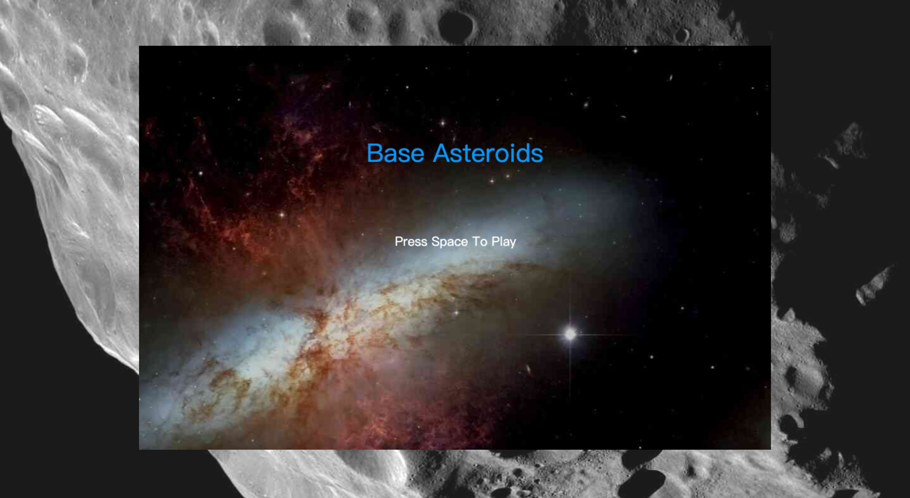
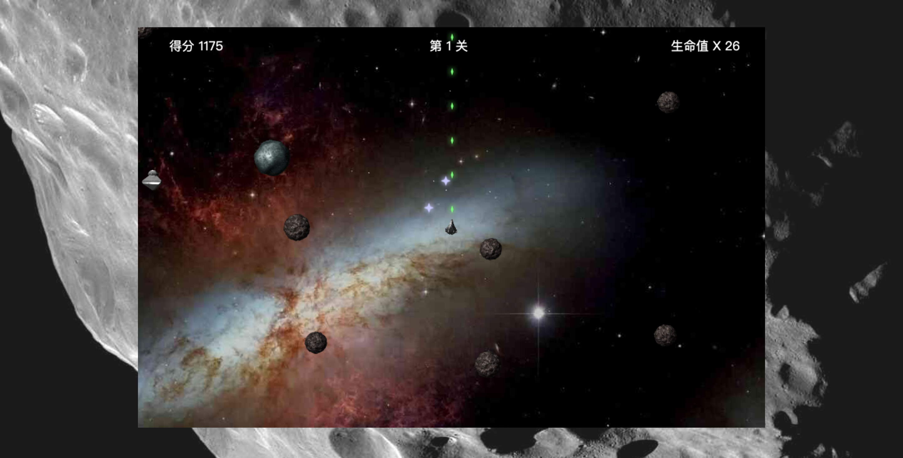
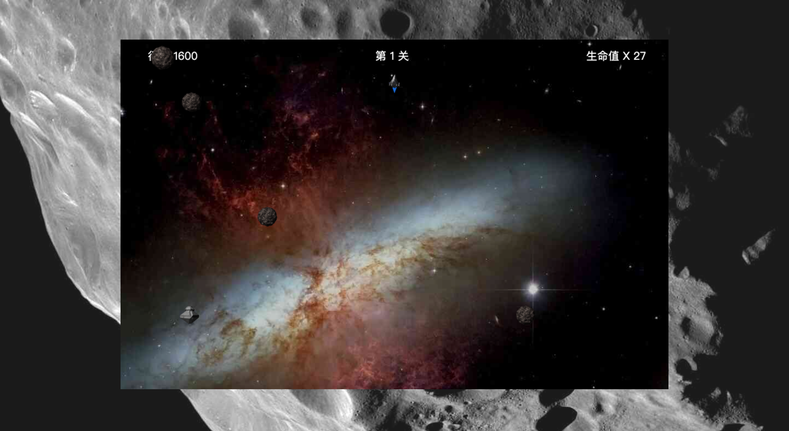

# Asteroids

《爆破彗星》（英语：Asteroids）是 Atari 公司在 1979 年发行的一个街机游戏。它是街机黄金年代里其中一个最受欢迎及具影响力的游戏。《爆破彗星》使用矢量图形与二维视角。玩家需要操控一架航天器去避开及以子弹摧毁飞来飞去的彗星。

**[在线试玩，点击直达](https://xikong1995.github.io/games/asteroids/index.html)**


游戏起始界面
<br/>


飞船发射导弹
<br/>


飞船点火前进
<br/>

## 介绍

本项目使用 TS + Canvas 实现了一个 Web 迷你版，麻雀虽小，五脏俱全。

**玩法说明：**

进入游戏后，按空格键开始游戏。玩家操纵飞船漫游，周围会出现陨石和飞碟，同时飞碟不定时向玩家发射子弹。

玩家可以发射子弹射击陨石和飞碟，击中时会得到一定的分数。累计分数每满一定数量就会奖励玩家一条生命。

当屏幕中所有陨石都消失后，就会进入下一关卡。玩家和陨石、飞碟、飞碟子弹相撞时，会爆炸死亡。

玩家生命条数为 0 时，游戏结束。

**操作说明：**

1. 左右键调整飞船方向
2. 向上键使用飞船点火加速
3. 空格键发射子弹

## 运行

```bash
// 本地启动
yarn serve

// 打包部署
yarn build
```

## 更新

**v 2.0.0**

此版本模型使用了图片，更加形象，同时增加了音效。

**v 1.0.0**

此版本较为简单，所有模型均使用画布绘制，无音效。

## 开发

如果您对游戏开发感兴趣，并且是初次接触，建议阅读本人的另一个项目[《捕鱼达人》](https://github.com/xikong1995/fishing-joy)，相对来说更易上手。

**目录说明：**

```
|-   public          ——资源文件，不参与webpack打包过程
|-   src/assets      ——资源文件，参与webpack打包过程
|-   src/config      ——配置文件，全局常量
|-   src/service     ——服务类
|-   src/models      ——动画模型
|-   src/types       ——TS类型声明
|-   src/utils       ——工具函数
|-   src/main.ts     ——主函数（入口文件）
```

**其他说明：**

项目核心逻辑参考 [HTML5 Canvas 开发详解](https://book.douban.com/subject/26184170/) 一书。

## 协议

[MIT](./LICENSE)
